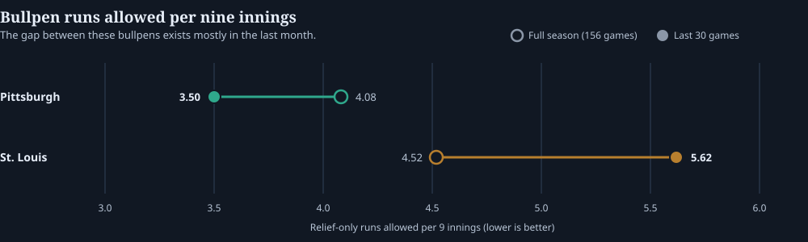

# Pirates −1.5: Why the Model Likes Pittsburgh

*The obvious numbers favor St. Louis. The part of the matchup our model likes is what happens after the starters leave.*

By Fourth & Value · September 21, 2026 · 4 min read  
Cardinals at Pirates · 6:41 p.m. ET at PNC Park · Prices captured 7:27 p.m. ET on September 21

## The Pick

> [!PICK]
**Pittsburgh Pirates −1.5, +155 at Bovada**

Best of seven prices in our snapshot; DraftKings and Caesars were next at +153. Model estimates are experimental. Confirm the line and timestamp before acting on this.

Model probability46.8%Break-even at +15539.2%Projected run margin+0.86

The model likes Pittsburgh to win by multiple runs.

At first glance, that is a little surprising.

St. Louis has scored more runs recently, and Cardinals starter Andre Pallante has slightly better recent run-prevention numbers than Pittsburgh starter Jared Jones.

So why Pittsburgh?

The bullpen.

## The Game May Be Decided After the Starters Leave

Neither starter has consistently been working deep enough to take the bullpen out of the equation.

That makes the recent difference between these relief staffs important.

Over the last 30 games:

*Relief-only runs allowed per nine innings, last 30 games*

| Team | Bullpen RA/9 |
|---|---|
| Pittsburgh | **3.50** |
| St. Louis | **5.62** |

That is a massive gap.

*Figure: The hollow marker is the full season; the filled marker is the last 30 games. Relief-only, computed by removing each game’s listed starter.*

Pittsburgh’s bullpen has also been covering about **4.5 innings per game** recently, while St. Louis’ relievers have averaged about **4.3**.

So if both starters get through roughly five innings, nearly half the game could be handed to the part of the matchup where Pittsburgh has had the clear recent advantage.

That is the main reason the model likes the Pirates despite some of the more obvious numbers pointing toward St. Louis.

## Jared Jones Helps the Case

Jones has also shown signs that Pittsburgh may be allowing him to work deeper into games.

His last three starts:

- 6 innings, 91 pitches

- 7 innings, 90 pitches

- 5 innings, 91 pitches

That is encouraging for Pittsburgh.

Jones does not necessarily need to dominate. If he can get through five or six innings, Pittsburgh can turn the game over to the stronger recent bullpen without asking that group to cover the entire night.

That creates a reasonable path to a multi-run Pirates win.

## Why We’re Not Calling It a Slam Dunk

There is an important catch.

The bullpen advantage looks much smaller when you zoom out.

Over the full season, Pittsburgh’s bullpen has allowed **4.08 runs per nine**, compared with **4.52 for St. Louis**.

That’s an advantage — but nothing like the enormous gap we’ve seen over the last month.

Jones’ heavier workload is also based on only three starts.

So the model is putting considerable weight on recent trends.

Maybe those trends represent real changes.

Maybe Pittsburgh’s bullpen really is pitching better, St. Louis’ bullpen really is struggling, and Jones really has earned a longer leash.

But recent baseball performance can also be noisy.

That’s why we view this differently from a high-confidence model play.

## The Bottom Line

The case for Pittsburgh −1.5 is not that the Pirates have the better offense or the better starting pitcher.

They don’t, based on the recent numbers we’re using.

The case is that this game is likely to spend several innings in the bullpens — and lately, that matchup has heavily favored Pittsburgh.

If Jones can give the Pirates five or six solid innings, the model sees Pittsburgh having a meaningful advantage in the second half of the game.

**Fourth & Value lean: Pittsburgh −1.5.**

It’s a play we like, but not one we’re treating as a major conviction bet.

The recent bullpen numbers are compelling enough to create the edge.

They’re also recent enough to keep us cautious.

**That’s the bet: Pittsburgh −1.5, with the bullpen doing most of the work.**

**Data.** [Bullpen splits](pirates-cardinals-2026/bullpen-splits.csv), [book quotes](pirates-cardinals-2026/book-prices.csv), [Jones’ 2026 log](pirates-cardinals-2026/jones-2026-game-log.csv) and [all calculations](pirates-cardinals-2026/analysis.json). Bullpen splits are computed from cached game files by removing each game’s listed starter. Prices and model output come from the saved board snapshot of September 21, 2026 at 23:27 UTC, with model inputs through September 20. See the [reproduction script](https://github.com/pbwitt/fourth-and-value/blob/main/scripts/analyze_pirates_runline_2026.py) and the [MLB methodology](../mlb/methods.html).

[← Back to Blog](index.html) · [See the MLB picks board](../mlb/picks.html)
